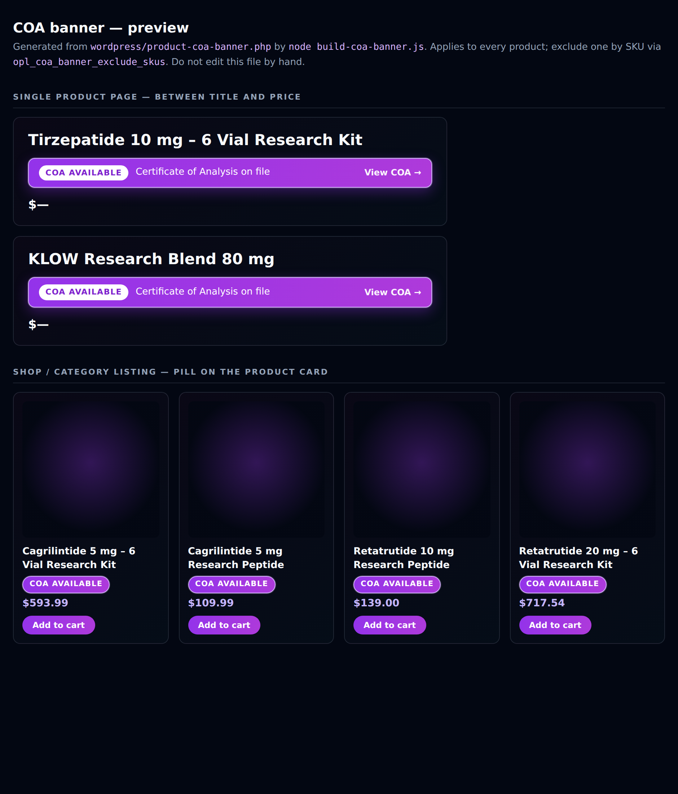

# Product COA banner

A small purple "COA Available" banner on thirteen research product pages, sitting
between the product title and the price.

**Status: live since 2026-09-01.** Verified on all thirteen pages, and confirmed
absent from every product not on the list.

Published handoff page:
<https://claude.ai/code/artifact/a92860d7-3738-48a4-a17e-9738cf8e6e48>
(source: [`coa-banner-handoff.html`](coa-banner-handoff.html) — republish that file to
update the same URL)



## Products it appears on

Matched by SKU, so the list survives a post-ID change. IDs recorded for reference
and verified against the live site on 2026-08-31.

| SKU | Product | ID | URL |
|---|---|---|---|
| `OP-REC-KLOW-80MG` | KLOW Research Blend 80 mg | 1948 | `/products/klow-blend-research-peptide/` |
| `OP-LON-GHKCU-50MG` | GHK-Cu 50 mg | 441 | `/products/ghk-cu-50mg-research-peptide/` |
| `OP-AUX-NAD-500MG` | NAD+ 500 mg | 63 | `/products/nad-500mg-research-compound/` |
| `OP-MET-RETA-5MG` | Retatrutide 5 mg | 3395 | `/products/retatrutide-5mg-research-peptide/` |
| `OP-COG-SELANK-5MG` | Selank 5 mg | 447 | `/products/selank-5mg-research-peptide/` |
| `OP-MET-SEMA-5MG` | Semaglutide 5 mg | 3397 | `/products/semaglutide-5mg-research-peptide/` |
| `OP-MET-TIRZ-10MG` | Tirzepatide 10 mg | 39 | `/products/tirzepatide-10mg-research-peptide/` |
| `OP-KIT-GHKCU-50MG-6` | GHK-Cu 50 mg – 6 Vial Research Kit | 3468 | `/products/ghk-cu-50-mg-6-vial-research-kit/` |
| `OP-KIT-NAD-500MG-6` | NAD+ 500 mg – 6 Vial Research Kit | 3459 | `/products/nad-500-mg-6-vial-research-kit/` |
| `OP-KIT-RETA-5MG-6` | Retatrutide 5 mg – 6 Vial Research Kit | 3465 | `/products/retatrutide-5-mg-6-vial-research-kit/` |
| `OP-KIT-SELANK-5MG-6` | Selank 5 mg – 6 Vial Research Kit | 3463 | `/products/selank-5-mg-6-vial-research-kit/` |
| `OP-KIT-SEMA-5MG-6` | Semaglutide 5 mg – 6 Vial Research Kit | 3457 | `/products/semaglutide-5-mg-6-vial-research-kit/` |
| `OP-KIT-TIRZ-10MG-6` | Tirzepatide 10 mg – 6 Vial Research Kit | 3454 | `/products/tirzepatide-10-mg-6-vial-research-kit/` |

The seven single vials plus the 6-vial kits of the same materials. KLOW has no kit.

No other product is touched. The banner links to `/research-peptides-with-coa/`.

## Install

The snippet is PHP because a banner under the product title has to hook
`woocommerce_single_product_summary` — that region is rendered by WooCommerce, not
stored in the product description, so there is nothing to paste per product.
One install covers all thirteen, and adding another is one line.

**Option A — WPCode / Code Snippets plugin (recommended, no theme files touched)**

1. Snippets → Add New → Add Your Own → **PHP Snippet**.
2. Title: `OligoPoly — product COA banner`.
3. Paste the whole contents of [`wordpress/product-coa-banner.php`](../wordpress/product-coa-banner.php),
   **without** the opening `<?php` line (WPCode supplies it).
4. Insertion: **Auto Insert → Run Everywhere**. Save and activate.

**Option B — child theme**

Append the file's contents (minus the opening `<?php`) to the child theme's
`functions.php`. Note this is lost on a theme change; Option A is not.

> Do not paste it into `hello-elementor` itself — the parent theme is overwritten
> on update.

## Verify

After activating, load any of the URLs above and confirm the banner appears
under the title. Then load a product that is *not* on the list (e.g.
`/products/bpc-157-10mg-research-peptide/`) and confirm it does **not**.

**Bust the cache when you check.** The site serves cached HTML to plain requests —
that is what made the banner look missing on the first check after install. Add a
unique query string and a no-cache header:

```sh
curl -s -H 'Cache-Control: no-cache' \
  "https://www.oligopolypeptides.com/products/selank-5mg-research-peptide/?nc=$(date +%s)" \
  | grep -c 'class="opl-coa-banner"'    # expect 1

curl -s -H 'Cache-Control: no-cache' \
  "https://www.oligopolypeptides.com/products/bpc-157-10mg-research-peptide/?nc=$(date +%s)" \
  | grep -c 'class="opl-coa-banner"'    # expect 0
```

Last run 2026-09-01: 13/13 listed pages carry exactly one banner and one stylesheet,
in the right DOM position (title → banner → trust block → price); 0/4 controls.

## Changing the list

Edit the `opl_coa_banner_products()` array in the snippet — one row per product,
keyed by SKU. Or, without editing the snippet, filter it:

```php
add_filter( 'opl_coa_banner_products', function ( $p ) {
    $p['OP-MET-CAGRI-5MG'] = array( 'label' => 'Cagrilintide 5 mg', 'id' => 436 );
    return $p;
} );
```

A per-product `'href'` key overrides the link target for that product.

After changing the list, re-run `node build-coa-banner.js` so the preview matches.

## Rollback

Deactivate the snippet (WPCode) or delete the appended block (child theme). The
banner and its CSS disappear completely — nothing is written to product data, so
there is nothing else to undo.

## Notes

- Display only. No product data, price, inventory, cart, checkout, payment,
  shipping, tax, or WooCommerce setting is read or written.
- CSS is inline, `opl-coa-` prefixed, and printed only on pages that show a
  banner — nothing loads sitewide.
- White text on the `#9333ea → #ae3ada` fill clears 4.5:1 (WCAG AA) at both ends
  of the gradient. The banner is a real link with a visible focus ring, and it
  honours `prefers-reduced-motion`.
- **Wording check:** the existing `opl-trust-status` block on these same pages is
  deliberately hedged ("Product-level records where available", "Exact-lot
  publishing is not yet enabled"). This banner states COA availability flatly. That
  is fine if a COA is genuinely on file for all seven; if any of them is
  record-pending, drop it from the list, so the two blocks on the page do not
  contradict each other. The kits carry the same claim as their single vials, on
  the assumption that a kit ships the same material and therefore the same COA.
- The banner's visible line does not name the product — it sits directly under the
  product title, so repeating the name is redundant and would wrap the longer kit
  titles onto a second line. Screen readers still get the name via `aria-label`.
